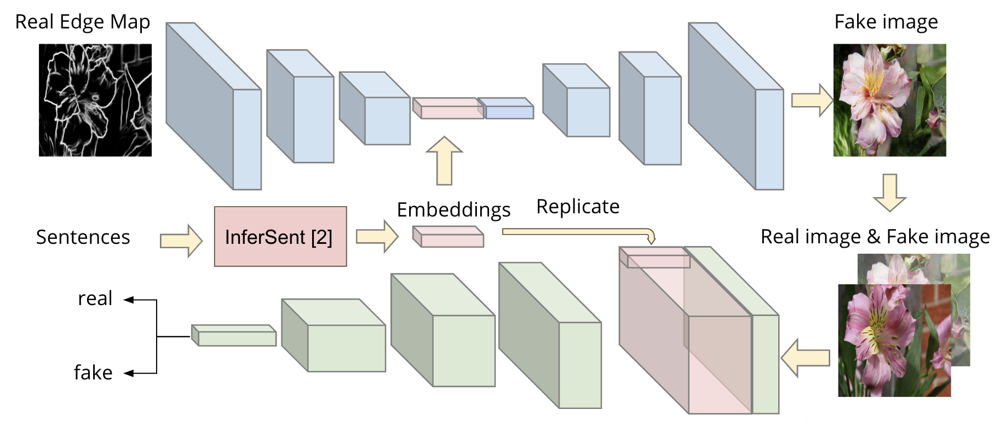
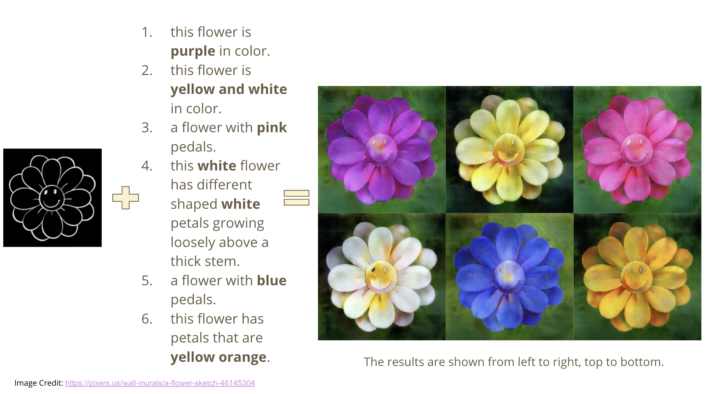

## Semantic Pix2Pix
This is our Deep Learning course project ([Jiarui Xu](https://github.com/jiaruixu), [Esther Robb](https://github.com/e-271), [Si Chen](https://github.com/SCccc21)). Our purpose of this project is to manipulate the attributes of the generated images with sentence embeddings.



### Sample results


### Installation
For conda users, you can create an environment using
```
conda create -n pix2pix python=3.5.5
bash ./scripts/conda_deps.sh
```

### Download Dataset

```
bash ./scripts/download_preprocessed_data.sh
```

### Train
Train with semantic pix2pix
```
python train.py \
      --dataroot /work/cascades/jiaruixu/dataset/edges2flowers \
      --name semanticv2_pix2pix \
      --model semanticv2_pix2pix \
      --direction AtoB \
      --dataset_mode semantic \
      --checkpoints_dir /work/cascades/jiaruixu/pix2pix/ \
      --display_id -1

python train.py \
      --dataroot datasets/flowers_samples \
      --name semanticv2_pix2pix_debug \
      --model semanticv2_pix2pix \
      --direction AtoB \
      --dataset_mode semantic \
      --display_id -1
```

Train with pix2pix
```
python train.py \
      --dataroot /work/cascades/jiaruixu/dataset/edges2flowers \
      --name pix2pix \
      --model pix2pix \
      --direction AtoB \
      --dataset_mode semantic \
      --checkpoints_dir /work/cascades/jiaruixu/pix2pix/ \
      --display_id -1
```

### Tensorboard for training logs

```
tensorboard --logdir=/work/cascades/jiaruixu/pix2pix/[exp_name]/logs
```

### Test with default sentences
Copy checkpoints into `./checkpoints/semanticv2_pix2pix_flowers/semanticv2_pix2pix`

```
python test.py \
       --dataroot /work/cascades/jiaruixu/dataset/edges2flowers \
       --name semanticv2_pix2pix_flowers \
       --model semanticv2_pix2pix \
       --dataset_mode semantic \
       --direction AtoB
       --checkpoints_dir ./checkpoints/semantic_pix2pix_flowers
```

### Test on customized sketches/edge maps with customized sentences

#### Download word vectors
Download GloVe (V1) vectors:
```
mkdir GloVe
curl -Lo GloVe/glove.840B.300d.zip http://nlp.stanford.edu/data/glove.840B.300d.zip
unzip GloVe/glove.840B.300d.zip -d GloVe/
```

#### Use InferSent sentence encoder

```
mkdir encoder
curl -Lo encoder/infersent1.pkl https://dl.fbaipublicfiles.com/infersent/infersent1.pkl
```

#### Test on customized sketches/edge maps with customized sentences

```
python edge2imgsample.py \
       --dataroot ./datasets/flower_samples \
       --checkpoints_dir /work/cascades/jiaruixu/pix2pix/ \
       --sentence_file flowersample.txt \
       --results_dir results \
       --model semanticv2_pix2pix \
       --name semanticv2_pix2pix_flowers \
       --dataset_mode semantic

```
### Acknowledgments
Our code is based on [pytorch-CycleGAN-and-pix2pix](https://github.com/junyanz/pytorch-CycleGAN-and-pix2pix) and [InferSent](https://github.com/facebookresearch/InferSent)
